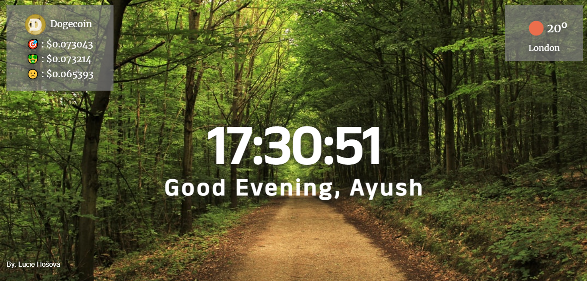

# Momentum Dashboard for Chrome
## Table of Content

 * [Overview of the Project](#overview-of-the-project)
      * [Goal of the project](#goal-of-the-project)
      * [Screenshot](#screenshot)
 * [Technologies I Used](#technologies-i-used)
 * [What I Learned](#what-i-learned) 
 * [Acknowledgement](#acknowledgement)

# Overview of the Project
The project is focused on making a Momentum Dashboard for the browser and make it as a chrome extension so that the user can use it in their browser also.

### Goal of the Project
* The Goal of this project is install it as a chrome extension so the user can use it as a browser.
* See the new browser each time a new tab is opened.
* See the new image if the unsplash API fails to load.
* See the local weather conditions if the user give the location access.
* See the current price of crytocurrency and its 24Hr highest and lowest price.
* Show the user the current time and greet them with good morning, afternoon, evening and night.

## Screenshot

## Technologies I Used
* Semantic HTML5.
* CSS.
* Javascript.
* API.

## What I Learned
* How to read through API documentation and use different API data.
* How to throw and catch error to add default image value if unsplash API fails to load.

## Acknowledgment
   My acknowledgements go out to the team at Scrimba. Enrolling in your courses made this project possible.
